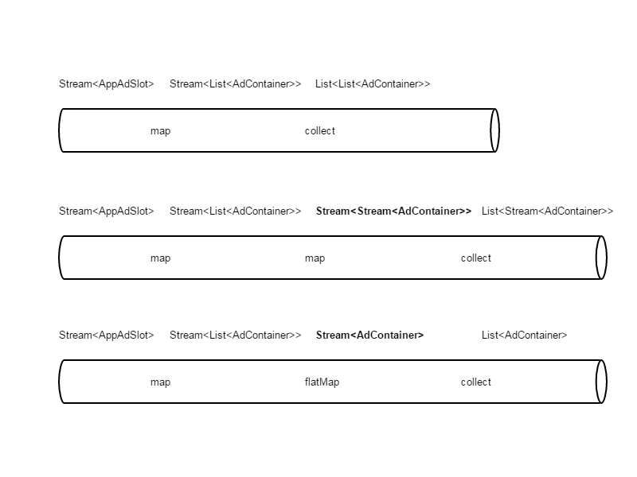

## 主要内容：

- Lambda表达式
- Stream流处理
- 常见业务场景下Stream使用

---

class: center, middle, inverse

# Lambda表达式

---

## Lambda表达式

所谓Lambda表达式就是匿名函数，由参数列表、箭头以及主体组成

```java
// Lambda示例
(String s) -> s.length()
() -> 42
(int x, int y) -> {
    System.out.print(x + ", " + y);
    return x + y;
}
```

--

形式：
- (params) -> expression
- (params) -> {statements;}

需要注意的是`return`是控制流语句

---

## 在哪里以及如何使用Lambda

在函数式接口上使用Lambda表达式

函数式接口就是只定义了一个抽象方法的接口

```java
Stream<T> filter(Predicate<? super T> predicate);
<R> Stream<R> map(Function<? super T, ? extends R> mapper);
```

---

## Lambda带来了哪些好处

```java
EXECUTOR_SERVICE.execute(new Runnable() {
    @Override
    public void run() {
        // do some thing
    }
});
```

--

```java
EXECUTOR_SERVICE.execute(() -> {
    // do some thing
});
```

--

Java8重大变化之一，方法和Lambda作为一等公民

---

## 方法和Lambda作为一等公民

即允许方法和Lambda作为值进行传递

```javascript
function compute(a, b, action) {
    console.log(action(a, b));
}

function add(a, b) {
    return a + b;
}

function minus(a, b) {
    return a - b;
}
```

```javascript
// 7
compute(3, 4, add)
// -1
compute(3, 4, minus)
```

---

class: center, middle, inverse

# Stream流处理

---

## Stream是什么

Stream是Java API的新成员，允许你以声明性的方式处理集合

```java
// 选出低卡洛里的菜品
List<String> lowCaloricDishName = menu
    .stream()
    .filter(d -> d.getCal() < 400)
    .sorted(comparing(Dish::getCal))
    .limit(5)
    .map(Dish::getName)
    .collect(toList())
```

--

组成：

- 数据源
- 中间操作链
- 终端操作

---

## Stream适用场景

- 一致、统一的处理过程

--

- 没有continue、break跳转

---

## Optional

是为了优雅的解决空指针，它可以把`null`值映射为`Optional.empty()`

```java
PageIterator<OrderEntity> orders = orderManageService...;
List<OrderEntity> ods = new ArrayList<>();
if (orders != null) {
    ods = orders.getData();
}
```

--

```java
PageIterator<OrderEntity> orders = orderManageService...;
List<OrderEntity> ods = Optional.ofNullable(orders)
            .map(PageIterator::getData)
            .orElse(Collections.emptyList());
```

---

class: center, middle, inverse

# 常见业务场景下的Stream使用

---

## Optional与Stream配合

```java
PageIterator<ReceiptEntity> receipts = ...;
List<ReceiptDetail> list = new ArrayList<>();
if (receipts != null && receipts.getData() != null) {
    for (ReceiptEntity receipt : receipts.getData()) {
        list.add(receiptEntity2Detail(receipt));
    }
}
```

--

```java
// java8
PageIterator<ReceiptEntity> receipts = ...;
List<ReceiptDetail> list = Optional.ofNullable(receipts)
    .map(PageIterator::getData)
    .orElse(Collections.emptyList())
    .stream()
    .map(this::receiptEntity2Detail)
    .collect(toList());
```


---

## 映射成别的类

```java
List<JobView> jobViews = getJobViews(jidList);
List<Integer> uids = new ArrayList<>();
for (JobView jobView : jobViews) {
    uids.add(jobView.getUid());
}
```

--

```java
// java8
List<Integer> uids = getJobViews(jidList)
            .stream()
            .map(j -> j.getUid())
            .collect(toList());
```

---

## 带索引的for循环

```java
List<JobView> jobViews = getJobViews(jidList);
for (int i = 0; i < jobViews.size(); i++) {
    // do some thing
}
```

--

```java
// java8
List<JobView> jobViews = getJobViews(jidList);
IntStream.range(0, jobViews.size()).forEach(i -> {
    // do some thing
});
```

---

## 带索引的多重循环

```java
List<JobView> jobViews = getJobViews(jidList);
for (int i = 0; i < jobViews.size(); i++) {
    for (int j = 0; j < i; j++) {
        // do some thing
    }
}
```

--

```java
// java8
List<JobView> jobViews = getJobViews(jidList);
IntStream.range(0, jobViews.size())
    .forEach(i -> IntStream.range(0, i)
        .forEach(j -> {
            // do some thing
        }));
```

---

## 流的扁平化

```java
// 大家可以先去看看AppAdSlot的数据结构
List<AppAdSlot> adSlots = ...;
List<AdContainer> containers = new ArrayList<>();
if (CollectionUtils.isNotEmpty(adSlots)) {
    for (AppAdSlot slot : adSlots) {
        for (AppAdUnit unit : slot.getAppAdUnits()) {
            containers.add(adUnit2Container(unit));
        }
    }
}
```

--

```java
// java8
List<AppAdSlot> adSlots = ...;
List<AdContainer> containers = Optional.ofNullable(adSlots)
    .orElse(Collections.emptyList())
    .stream()
    .map(a -> a.getAppAdUnits()
               .stream()
               .map(this::adUnit2Container)
               .collect(toList()))
    .flatMap(Collection::stream)
    .collect(toList());
```
???
flatMap将map函数的返回值组合成一个流
---

## 流的扁平化图解



---

## List转为Map

```java
List<Interview> interviewList = ...;
Map<Integer, Interview> interviewMap = new HashMap<>();
for (Interview interview : interviewList) {
    interviewMap.put(interview.getApplyId(), interview);
}
```

--

```java
// java8
List<Interview> interviewList = ...;
Map<Integer, Interview> interviewMap = interviewList
    .stream()
    .collect(
      toMap(Interview::getApplyId, o -> o, (i1, i2)-> i2));
    //toMap(Interview::getApplyId, o -> o)
    
```

---

## 字符串拼接

```java
private String getAddress(List<AddressVo> addresses) {
    StringBuilder sb = new StringBuilder();
    if (CollectionUtils.isNotEmpty(addresses)) {
        for (AddressVo a : addresses) {
            sb.append(a.getPoi().getName());
        }
        return sb.toString();
    }
    return "";
}
```

--

```java
// java8
private String getAddress(List<AddressVo> addresses) {
    return Optional.ofNullable(addresses)
        .orElse(Collections.emptyList())
        .stream()
        .map(a -> a.getPoi().getName())
        .collect(joining());
}
```

---

## 求和

```java
List<Order> orders = ...;
int money = 0;
for (Order o : orders) {
    if (isBetweenReceiptDate(o, now)) {
        money += o.getMoney();
    }
}
```

--

```java
// java8
orders
    .stream()
    .filter(o -> isBetweenReceiptDate(o, now))
    .mapToInt(Order::getMoney)
    .sum();
```

---

## 分组（1）

```java
Map<Integer, List<C2CInvitation>> 
splitByUser(List<C2CInvitation> invitations) {
    if (CollectionUtils.isNotEmpty(invitations)) {
        Map<Integer, List<C2CInvitation>> map = 
            new HashMap<>();
            
        for (C2CInvitation i : invitations) {
            int key = getTableIndex(i.getUid());
            if (map.get(key) == null) {
                List<C2CInvitation> list =
                    new ArrayList<>();
                list.add(i);
                map.put(key, list);
            } else {
                map.get(key).add(i);
            }
        }
        return map;
    }
    return Collections.emptyMap();
}
```

---

## 分组（2）

```java
// java8
Map<Integer, List<C2CInvitation>> 
splitByUser(List<C2CInvitation> invitations) {
        
    return Optional.ofNullable(invitations)
        .orElse(Collections.emptyList())
        .stream()
        .collect(
            groupingBy(i -> getTableIndex(i.getUid())));
}
```

---

## 分区

```java
Map<Boolean, List<Long>> splitNewAndOld(List<Long> ids) {
    return Optional.ofNullable(ids)
        .orElse(Collections.emptyList())
        .stream()
        .collect(partitioningBy(InvitationDaoUtil::isNew));
}
```

---

## 排序（1）

```java
PageIterator<OrderEntity> orderPages = ...;
List<Order> orders = new ArrayList<>();
if (orderPages != null && orderPages.getData() != null) {
    for (OrderEntity o : orderPages.getData()) {
        orders.add(
        new Order(o.getId(), o.getMoney(), o.getPayDate()));
    }
    
    Collections.sort(orders, new Comparator<Order>() {
        @Override
        public int compare(Order o1, Order o2) {
            if (o1.getId() > o2.getId()) {
                return 1;
            } else if (o1.getId() < o2.getId()) {
                return -1;
            } else {
                return 0;
            }
        }
    });
}
```

---

## 排序（2）

```java
// java8
PageIterator<OrderEntity> orderPages = ...;
List<Order> orders = Optional.ofNullable(orderPages)
    .map(PageIterator::getData)
    .orElse(Collections.emptyList())
    .stream()
  //.sorted(comparingInt(OrderEntity::getId).reversed())
    .sorted(comparingInt(OrderEntity::getId))
    .map(o -> 
         new Order(o.getId(), o.getMoney(), o.getPayDate()))
    .collect(toList());
```

---

## 数组流

```java
int[] seqs = JOB_SEQS[function - 1];
List<Integer> seqList = new ArrayList<>();
for (Integer s : seqs) {
    seqList.add(s);
}
List<JobView> jobViews = jobQueryService.getByIds(seqList)
```

--

```java
// java8
int[] seqs = JOB_SEQS[function - 1];
List<JobView> jobViews = j...e.getByIds(Arrays.stream(seqs)
    .boxed()
    .collect(toList()));
```


